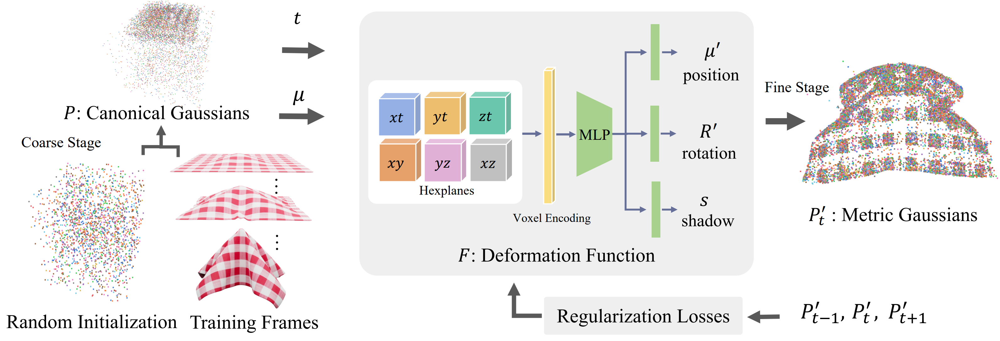

# MD-Splatting: Learning Metric Deformation from 4D Gaussians in Highly Deformable Scenes

## arXiv Preprint

### [Project Page](https://kth-rpl.github.io/cloth-splatting/)| [Paper](https://openreview.net/pdf?id=WmWbswjTsi)

---------------------------------------------------

---

   


## Installation 

**Docker Image**

We use `python3.10` and `cuda 12.1` for our experiments.
In case you want to set up a custom environment, you can use the following commands to create a new conda environment and install the required cuda version.
```
conda create -n cloth-splatting python=3.10
conda activate cloth-splatting
conda install cuda -c nvidia/label/cuda-12.1.0
```
For the torch dependencies we use `torch 2.2.0`.
```
pip install torch==2.2.0 torchvision --index-url https://download.pytorch.org/whl/cu121
```
For the installation of the `torch_geometric` dependencies, for more information refer to the [official installation guide](https://pytorch-geometric.readthedocs.io/en/latest/notes/installation.html).

```
pip install torch_geometric
pip install pyg_lib torch_scatter torch_sparse torch_cluster torch_spline_conv -f https://data.pyg.org/whl/torch-2.2.0+cu121.html
```
For the remaining pip dependencies, you can install them using the requirements.txt file.
```
pip install -r requirements.txt
```
For the submodules, you can install them using the following commands.
``` 
git submodule update --init --recursive
pip install -e submodules/depth-diff-gaussian-rasterization
pip install -e submodules/simple-knn
```


## Data
**For synthetic scenes:**  
The dataset provided [here](https://drive.google.com/drive/folders/116XTLBUvuiEQPjKXKZP8fYab3F3L1cCd?usp=sharing) can be used with MD-Splatting to enable novel view synthesis and dense tracking. After downloading the dataset, extract the files to the `data` folder. The folder structure should look like this:

```
├── data
│   | final_scenes 
│     ├── scene_1
│     ├── scene_2 
│     ├── ...
```


## Training
To train models for all scenes from the paper, run the following script:
``` 
./run_scripts/run_all.sh
``` 

## Rendering
Run the following script to render images for all scenes. 

```
./run_scripts/render_all.sh
```

## Run Scripts

There are some other useful scripts in the run_scripts directory. Some of it is messy and needs to be cleaned up, but they'll allow you to easily run ablations and log the results.


---
## Contributions

---
Some source code of ours is borrowed from [3DGS](https://github.com/graphdeco-inria/gaussian-splatting), [k-planes](https://github.com/Giodiro/kplanes_nerfstudio),[HexPlane](https://github.com/Caoang327/HexPlane), [TiNeuVox](https://github.com/hustvl/TiNeuVox), [4DGS](https://github.com/hustvl/4DGaussians). We appreciate the excellent works of these authors.


## Citation
```
@misc{duisterhof2023mdsplatting,
      title={MD-Splatting: Learning Metric Deformation from 4D Gaussians in Highly Deformable Scenes}, 
      author={Bardienus P. Duisterhof and Zhao Mandi and Yunchao Yao and Jia-Wei Liu and Mike Zheng Shou and Shuran Song and Jeffrey Ichnowski},
      year={2023},
      eprint={2312.00583},
      archivePrefix={arXiv},
      primaryClass={cs.CV}
}
```
